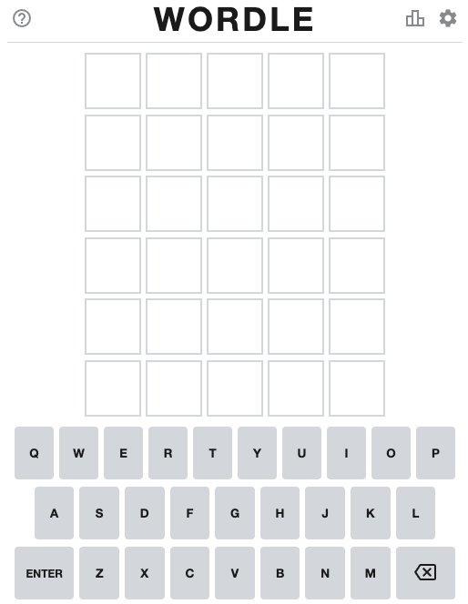
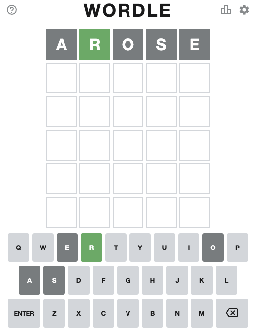
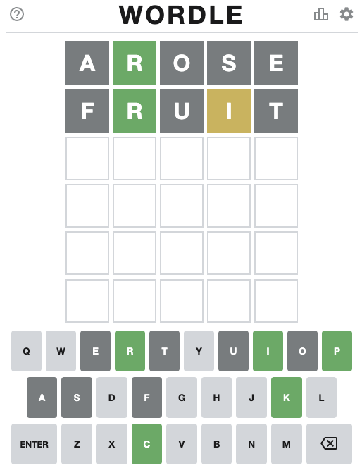
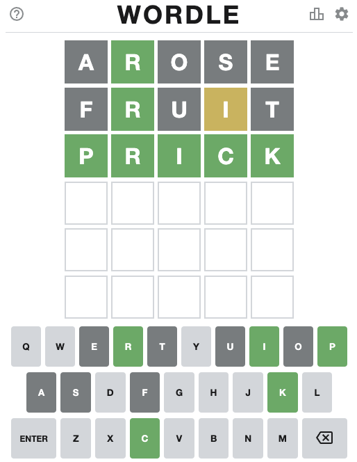

# wordle
python wordle solver


## Usage:



*First guess:*

```
⇒  ./wordle.py .....
20458: arose
20458: oreas
20455: aries
20455: arise
20455: raise
20455: serai
20369: leora
20366: ariel
20353: erian
20353: irena
20353: reina
20306: orate
20303: arite
20303: artie
20303: irate
20303: retia
```

Note that not all words in the input dict `/usr/share/dict/words` are in the wordle dictionary so you may
need to skip the highest rated words. `arose` is my go-to start word.




*Second Guess:*

```
⇒  ./wordle.py .R... --guess 5 --nots aose
239: bruit
239: fruit
230: irgun
229: bruin
226: print
225: urbic
```

Don't know what `bruit` is. Would think it's not in most puzzle word lists.
Go with `fruit` instead.



*Third Guess:*

```
⇒  ./wordle.py .R.i. --guess 5 --nots aosefut
84: prink
82: prick
80: crink
79: crimp
79: gripy
78: brink
```

Not sure I've heard of `prink` so go with `prick`.
Got it!


