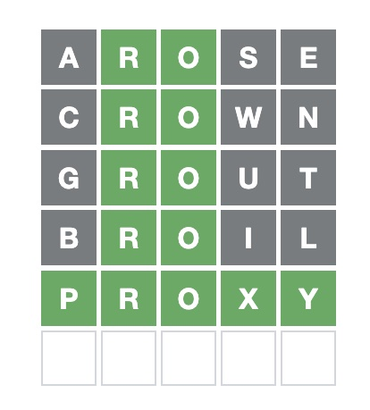

# wordle
python wordle solver


## Usage:

*First guess:*

```
% ./wordle.py .....                                                                                          22-01-18 - 7:56:54
12623: aries
12623: arise
12623: raise
12623: serai
12567: erian
12567: irena
12567: reina
12550: ariel
12526: arite
12526: artie
12526: irate
12526: retia
12526: tarie
12431: arose
12431: oreas
12358: leora
```

Note that not all words in the input dict `/usr/share/dict/words` are in the wordle dict so you may
need to skip the highest rated words. Also, if there are a bunch of obscure words at the top of the
list then a very common word, you may want to go with the more common word.




*Second Guess:*

```
% ./wordle.py .RO.. --nots ase --guess 5                                                                     22-01-18 - 8:01:48
140: crown
140: tronc
135: bronc
135: grown
135: wrong
134: crony
```

Ugh. 

*Third Guess:*

```
% ./wordle.py .RO.. --nots asecwn --guess 5                                                                  22-01-18 - 8:01:51
43: dropt
43: grout
41: drogh
41: droit
41: group
39: broth
```

Sigh.


*Fourth Guess:*

```
% ./wordle.py .RO.. --nots asecwngut --guess 5                                                               22-01-18 - 8:02:56
10: drovy
10: proxy
9: broil
```

I went with `broil` -- should have gone with `proxy` -- assuming `drovy` is not in the _wordle_ dictionary.

This was a bad example because there were no "near misses" - that is, guesses that are in the word but in 
the wrong place. Will make a better example tomorrow.
